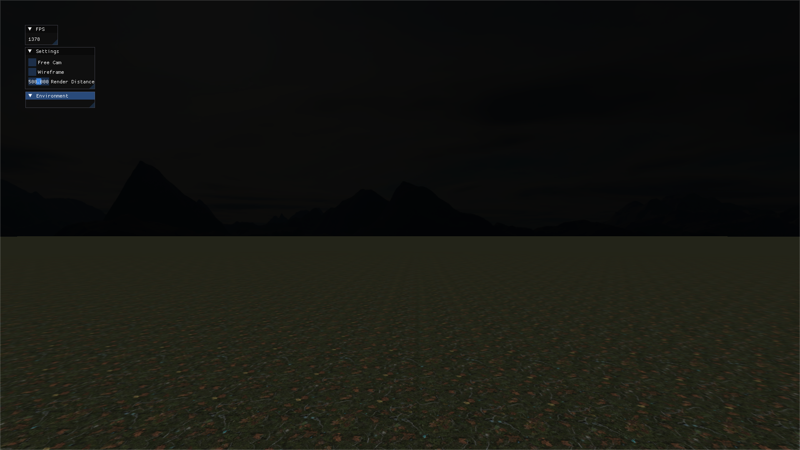

# OpenGL Horror Game
Im building a **Horror game from scratch in OpenGL**.

## Gameloop
It will take place in a **Dark Forest**, where you have to **complete tasks and collect items**,
while a **Monster** is hunting you.

## Contents
The player will have a flashlight.
The Forest will be dark, filled with trees and a heavy layer of fog.
Abandoned buildings and other interesting models will be scattered throughout the forest.

## Current State - Progress
Right now its just a **test World with a flat floor, skybox and movement.**



## How to Build
You can build simply via the nop.cpp (nobuild).
Its a more simpler approach than having a dedicated build File.

Just Run
```
clang++ nop.cpp -o nop
```
and then
```
./nop     # to build game
./nop run # to build and run
```
