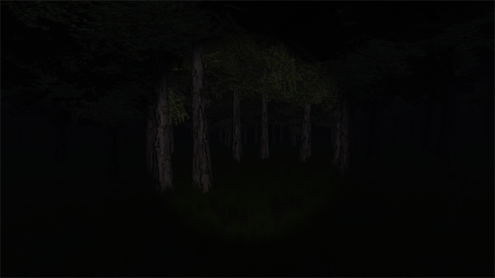
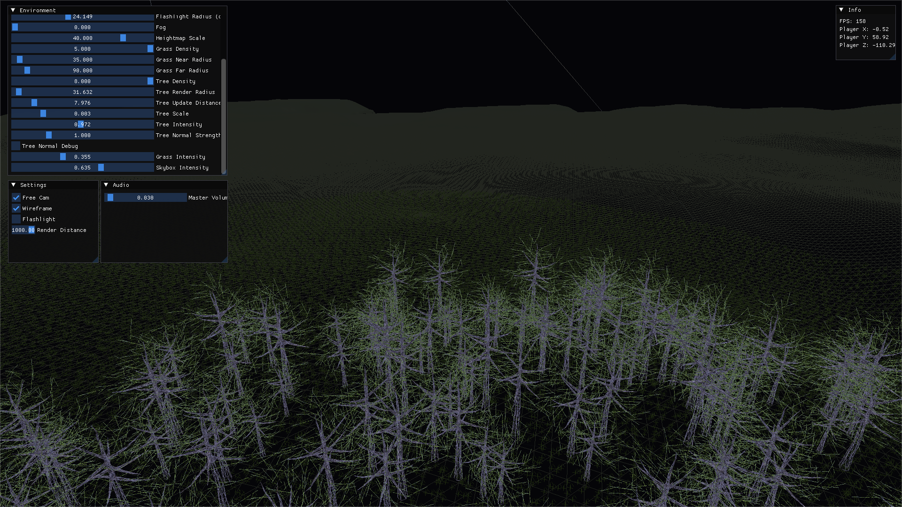

# OpenGL Horror Game
Im building a **Horror game from scratch in OpenGL**.

## Gameloop
It takes place in a **Dark Forest**, where you have to **complete tasks and collect items**,
while a **Monster** is hunting you.

## Contents
The player has a complementary horror game flashlight.
The Forest is dark, filled with trees and a heavy layer of fog.
Abandoned buildings and other interesting models are scattered throughout the forest.

## Current State - Progress



## How to Build
You can build simply via the nob.cpp (nobuild).

Just Run
```
clang++ nob.cpp -o nob # compile build file
```
and then
```
./nob     # to build game
./nob run # to build and run
```
